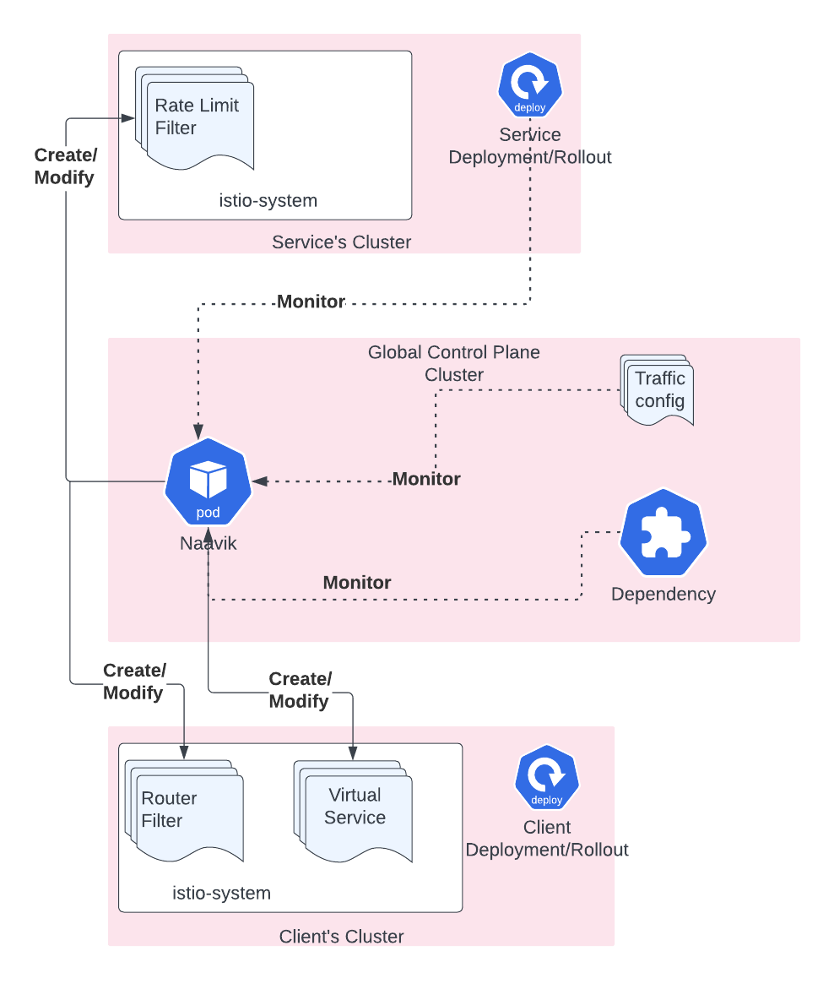

# Naavik

<!--  
 -->

Naavik assists in unification of configurations across API Gateway and Service Mesh. It acts upon a custom resource called TrafficConfig to apply the configurations done by the user in dev portal, and transforms them into service mesh understandable resources.

# High level Architecture Diagram

# How to run Naavik locally
- Refer to [Development Guide](./docs/DEVELOPER.MD).
- More details on internals of Naavik can be found [here](./docs/)

