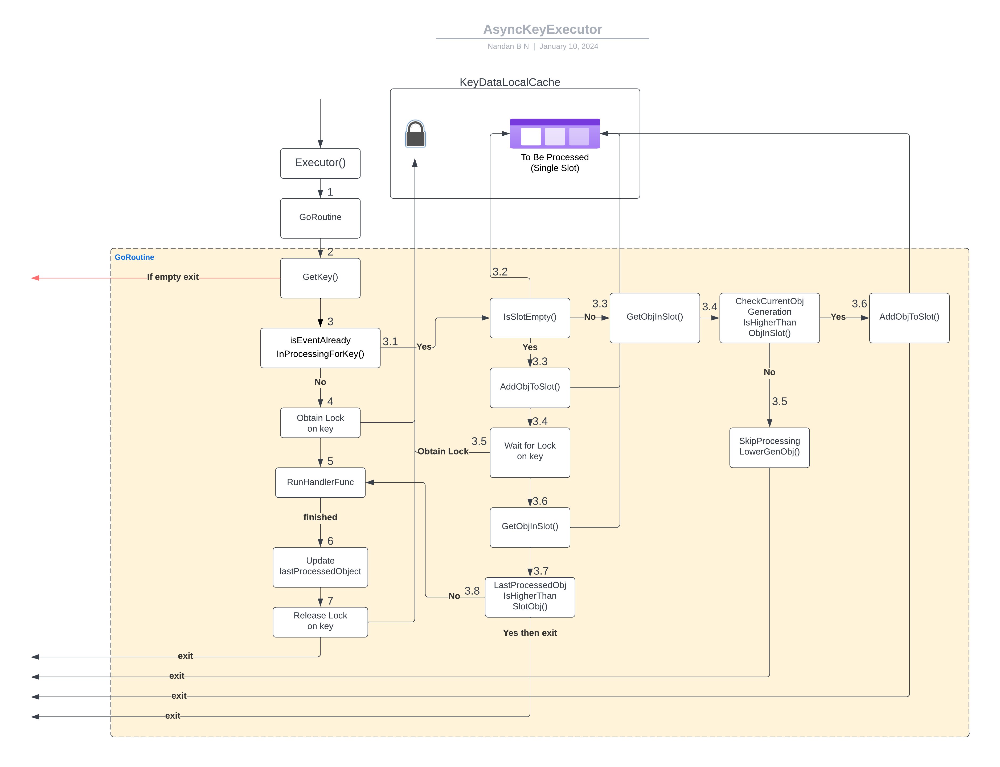

# Async Key Executor

`AsyncKeyExecutor` is a generic executor which uses the `AsyncKeyBasedRunner` as delegator.

It helps to execute events of different obj concurrently within independent go routines and events of same obj sequentially, helping the informer workers to scale independently.

To understand Async Key Executor, let's take an example and some scenarios.

1. We have a resource of type `ResourceA`
2. We receive 3 events for `ResourceA` concurrently
3. All 3 events are for same object named `example-resourcea` in namespace `example-namespace`
4. Lets say we have handler `Update` that takes 5mins to process a event

#### First event for resourcea-1 enters the executor and being processed by `Update` handler

* When the first event `example-resourcea` arrives, executor spawns a goroutine with obj context, let's call it `goroutine-1`. 
* Executor gets the key - Let's say `example-namespace/example-resourcea`
* Executor aquires the lock on the key as no goroutines are processing the same key obj so far.
* Executor runs the runner function.
* Once the runner function completes, executor updates the lastProcessedObject with the current obj.
* Executor releases the lock and goroutine completes.

#### Second event for resourcea-1 with higher generation enters executor event while first is being processed

* When the second event for `example-resourcea` arrives while first is still being processed in `goroutine-1`.
* Executor spawns a new goroutine (`goroutine-2`) with new obj context.
* It gets the key - Let's say `example-namespace/example-resourcea`
* Then it tries to acquire the lock on the key but fails as `goroutine-1` is still processing the same key obj.
* Checkes if the slot is empty and adds the new obj context to the slot of key runner data (one slot queue).
* It waits for the `goroutine-1` to complete by waiting on the lock.
* Once the `goroutine-1` completes, `goroutine-2` aquires the lock and gets the obj context from the slot.
* Executor runs the runner function.
* Once the runner function completes, executor updates the lastProcessedObject with the current obj.
* Executor releases the lock and goroutine completes.

#### Third event for resourcea-1 enters executor with higher generation than the first and second event while first is still being processed and second event is in the slot

* When the third event for `example-resourcea` arrives while first is still being processed in `goroutine-1` and second event is in the slot.
* Executor spawns a new goroutine (`goroutine-3`) with new obj context.
* It gets the key - Let's say `example-namespace/example-resourcea`
* Then it tries to acquire the lock on the key but fails as `goroutine-1` is still processing the same key obj.
* Checkes if the slot is empty and since the slot has the obj context of second event, it compares the generation of the obj context in the slot with the current obj context.
* Since the generation of the obj context in the slot is less than the current obj context, it replaces the obj context in the slot with the current obj context.
* After updating the slot the `goroutine-3` completes.
* Note the `gouroutine-2` is still waiting on the lock to process from the slot.
* Once the `goroutine-1` completes, `goroutine-2` aquires the lock and gets the obj context from the slot, which is the third event.
* Executor runs the runner function.
* Once the runner function completes, executor updates the lastProcessedObject with the current obj.
* Executor releases the lock and goroutine completes.

#### Fourth event for resourcea-1 enters executor with lower generation than the first, second and third event while first is still being processed and second and third event is in the slot

* When the fourth event for `example-resourcea` arrives while first is still being processed in `goroutine-1` and `goroutine-2` is still waiting on the lock to process from the slot (slot contains third event).
* Executor spawns a new goroutine (`goroutine-4`) with new obj context.
* It gets the key - Let's say `example-namespace/example-resourcea`
* Then it tries to acquire the lock on the key but fails as `goroutine-1` is still processing the same key obj.
* Checkes if the slot is empty and since the slot has the obj context of third event, it compares the generation of the obj context in the slot with the current obj context.
* Since the generation of the obj context in the slot is greater than the current obj context, it does not replace the obj context in the slot.
* Goroutine completes with no further action.

#### New event for resourcea-2 (a different resource) enter executor while a event for resourcea-1 is being processed
* When the new event for `example-resourcea-2` arrives while `example-resource-1` is still being processed in `goroutine-1`.
* Executor spawns a new goroutine (`goroutine-2`) with `example-resourcea-2`` obj context.
* It gets the key - Let's say `example-namespace/example-resourcea-2`
* Then it tries to acquire the lock on the key and succeeds as no goroutines are processing the same key obj so far.
* Executor runs the runner function.
* Once the runner function completes, executor updates the lastProcessedObject with the current obj.
* Executor releases the lock and goroutine completes.

